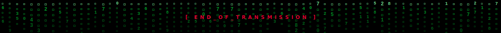

<!--
████████████████████████████████████████████████████████████████████████████████
   @anku0669 · AI HACKER · DARK THEME · v4.0  "ELITE"
   palette: bg #000000 · fg #00FF41 · accent #FF0033 · warn #FFD43B
████████████████████████████████████████████████████████████████████████████████
-->

<!-- ━━━━━━━━━━━━━━━━━━━━━ HEADER · MATRIX RAIN ━━━━━━━━━━━━━━━━━━━━━ -->
<a href="https://github.com/anku0669">
  
</a>

<!-- ━━━━━━━━━━━━━━━━━━━━━ TYPING SUBHEAD ━━━━━━━━━━━━━━━━━━━━━ -->
<div align="center">

<a href="https://github.com/anku0669">
  
</a>

<br/>

<a href="https://github.com/anku0669"></a>
<a href="https://github.com/anku0669?tab=followers"></a>
<a href="https://github.com/anku0669"></a>


</div>

<br/>

<!-- ━━━━━━━━━━━━━━━━━━━━━━━━━━━━━━━━━━━━━━━━━━━━━━━━━━━━━━━━━━━━━━━ -->
##                    `┌─[ ▓ ./whoami ]─────────────────────────────────────┐`

<a href="https://github.com/anku0669">
  
</a>

```bash
$ ./profile --decrypt --verbose

[+] Identity ........... Ankush
[+] Handle ............. @anku0669
[+] Role ............... AI Security Researcher · Red Team
[+] Specialty .......... LLM Jailbreaks · Prompt Injection · Adversarial Mutation
[+] Active Ops ......... Encryption Pipelines · Biometric Auth · OSINT
[+] Stack .............. Python · Java · C · Bash · Linux · Docker
[+] Mantra ............. "I don't break the rules. I find the bugs in them."
[+] Status ............. ⚡ ONLINE — scanning the matrix...
```

##                    `└─[ ▓ ./arsenal ]─────────────────────────────────────┘`

<div align="center">

<table>
<tr>
<td valign="top" width="50%">

#### `›_ LANGUAGES`


</td>
<td valign="top" width="50%">

#### `›_ TOOLING`


</td>
</tr>
<tr>
<td valign="top" width="50%">

#### `›_ AI / ML`


</td>
<td valign="top" width="50%">

#### `›_ INFRA`


</td>
</tr>
</table>

<br/>

<kbd>**`OFFENSIVE`**</kbd>


<br/>

<kbd>**`AI / ML SECURITY`**</kbd>


<br/>

<kbd>**`DEFENSIVE`**</kbd>


</div>

##                    `┌─[ ▓ ./operations ]──────────────────────────────────┐`

```
[CLASSIFIED] OPERATIONS LOG · CLEARANCE: TS//SCI//NOFORN
─────────────────────────────────────────────────────────────────────────────
├─ OP-HASH3R              [ACTIVE  ]   Argon2 · Bcrypt · MD5 · SHA · Blake3 CLI
├─ OP-IMAGE_ENCRYPTION    [ACTIVE  ]   Visual data encryption pipeline
├─ OP-FACE_AUTH           [ACTIVE  ]   Biometric authentication system (OpenCV)
├─ OP-CARD_ENCRYPTION     [ACTIVE  ]   Payment data protection layer
├─ OP-USER_AUTH           [ACTIVE  ]   Secure auth + session hardening
├─ OP-KEYLOGGER           [ARCHIVED]   Educational research · keystroke capture
└─ OP-SENTINEL-X          [STEALTH ]   Unified AI cybersecurity command center
─────────────────────────────────────────────────────────────────────────────
> ./list --all  →  https://github.com/anku0669?tab=repositories
```

<div align="center">

#### `›_ FEATURED PINNED OPS`

<a href="https://github.com/anku0669/Hash3r">
  
</a>
<a href="https://github.com/anku0669/face_auth">
  
</a>
<br/>
<a href="https://github.com/anku0669/image_encryption">
  
</a>
<a href="https://github.com/anku0669/card_encryption">
  
</a>

</div>

<br/>

<details>
<summary><b>›_ <code>$ ls -la /repos</code> &nbsp;— full repository index (click to expand)</b></summary>
<br/>

| op | language | role | status |
|---|---|---|---|
| [**Hash3r**](https://github.com/anku0669/Hash3r) | Python | Argon2 / Bcrypt / SHA / Blake3 hashing CLI | 🟢 ACTIVE |
| [**face_auth**](https://github.com/anku0669/face_auth) | Python | Biometric authentication (OpenCV) | 🟢 ACTIVE |
| [**image_encryption**](https://github.com/anku0669/image_encryption) | CSS / JS | Visual data encryption pipeline | 🟢 ACTIVE |
| [**card_encryption**](https://github.com/anku0669/card_encryption) | HTML | Payment data protection | 🟢 ACTIVE |
| [**user_auth**](https://github.com/anku0669/user_auth) | HTML | Secure auth + session hardening | 🟢 ACTIVE |
| [**Keylogger**](https://github.com/anku0669/Keylogger) | Python | Keystroke capture (educational) | 🟡 ARCHIVED |
| [**Future_CS_01**](https://github.com/anku0669/Future_CS_01) | HTML | Future CS internship task #1 | 🔵 SUBMITTED |
| [**Future_CS_02**](https://github.com/anku0669/Future_CS_02) | — | Future CS internship task #2 | 🔵 SUBMITTED |
| [**Slash_Task_1**](https://github.com/anku0669/Slash_Task_1) | HTML | Slash internship task | 🔵 SUBMITTED |
| [**TicTacToe**](https://github.com/anku0669/TicTacToe) | Java | Java fundamentals | 🟣 LEGACY |
| [**Find-Square-Root-**](https://github.com/anku0669/Find-Square-Root-) | Java | Algorithm exercise | 🟣 LEGACY |
| [**Temperature-Converter-**](https://github.com/anku0669/Temperature-Converter-) | Java | Algorithm exercise | 🟣 LEGACY |

</details>

##                    `└─[ ▓ ./diagnostics ]────────────────────────────────┘`

<div align="center">


<br/>


<br/>

<!-- lowlighter/metrics — auto-generated by .github/workflows/metrics.yml -->


<br/>


</div>

##                    `┌─[ ▓ ./activity ]──────────────────────────────────┐`

<div align="center">


<br/><br/>

<!-- snake animation — auto-generated by .github/workflows/snake.yml -->
<picture>
  <source media="(prefers-color-scheme: dark)" srcset="https://raw.githubusercontent.com/anku0669/anku0669/output/github-contribution-grid-snake-dark.svg" />
  <source media="(prefers-color-scheme: light)" srcset="https://raw.githubusercontent.com/anku0669/anku0669/output/github-contribution-grid-snake.svg" />
  
</picture>

<br/><br/>

<!-- 3D contributions — auto-generated by .github/workflows/profile-3d.yml -->


</div>

##                    `└─[ ▓ ./manifesto ]────────────────────────────────┘`

<details open>
<summary><b>›_ <code>$ cat /etc/manifesto.txt</code></b></summary>

```
> ELEVEN PRINCIPLES OF THE MODERN AI HACKER
─────────────────────────────────────────────────────────────────────────────
01.  every model has a glitch.            06.  red team or get red-teamed.
02.  prompts are programs.                07.  defense begins with offense.
03.  jailbreaks are documentation.        08.  encrypt everything by default.
04.  alignment is asymmetric warfare.     09.  trust no input. validate twice.
05.  the cli > the gui.                   10.  share what you break.
                                          11.  question reality. ship the fix.
─────────────────────────────────────────────────────────────────────────────
```

</details>

<br/>

<div align="center">


</div>

##                    `┌─[ ▓ ./comms ]─────────────────────────────────────┐`

<div align="center">

<a href="mailto:devisavitri751@gmail.com"></a>
<a href="https://github.com/anku0669"></a>


</div>

<br/>

<!-- ━━━━━━━━━━━━━━━━━━━━━ FOOTER · MATRIX RAIN ━━━━━━━━━━━━━━━━━━━━━ -->


<div align="center">

<sub><i>"In the silence of code, the loudest exploits hide."</i></sub><br/>
<sub><i>"Hack the system. Break the model. Question reality."</i></sub><br/>
<sub><code>[ END_OF_TRANSMISSION · @anku0669 ]</code></sub>

</div>
